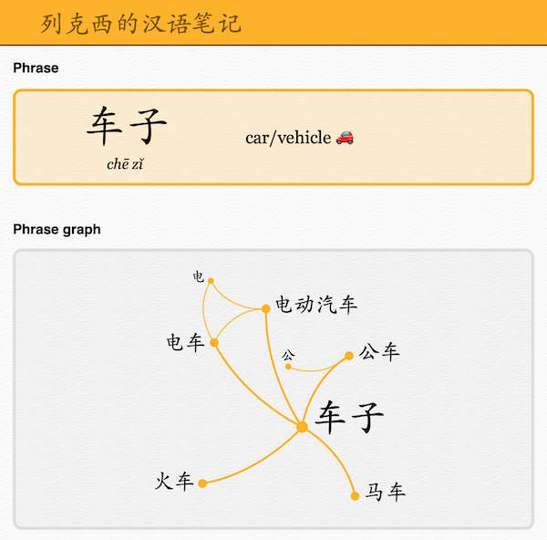

# vocabulary-graph

This is an experiment in displaying vocabulary as [a (network) graph][graphs] of related words and phrases.
When you look at a word, you can see a graph of related words:

[graphs]: https://en.wikipedia.org/wiki/Graph_(discrete_mathematics)

Words could be related for a number of reasons; what's important is that the relation makes them easier to remember.
For example:

*   If they have a common component or root
*   If they have a related meaning (such as words for family members, or directions, or modes of transport)
*   If they trigger a shared memory

I find it easier to remember a cluster of related words, than to learn each word separately.
I often draw word graphs by hand; this allows me to draw graphs on a bigger scale.

You can read more in [**the accompanying blog post**](https://alexwlchan.net/2020/04/vocabulary-graphs/), or play with the app [**on Glitch**](https://chinese-vocabulary-graph.glitch.me/).

## How it works

The heavy lifting is done by two libraries:

-   [**networkx**](https://pypi.org/project/networkx/) manages the graph data
-   [**D3.js**](https://d3js.org/) renders the graph visualisations

The graph is created entirely in networkx, then saved to JSON (`phrases_zh.json`).
The web app pulls out the appropriate nodes/edges and passes them to D3 to render.

## State of the code

This was an experiment to see if representing vocabulary as a graph was useful.
The code is pretty rough and not meant for other people to use.
